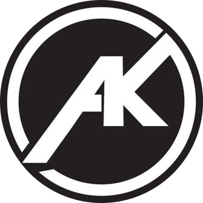

<div align="center">



# Ashish Kumar — Portfolio

An interactive, media-rich portfolio for an AI and Data Science developer.

[](https://www.ashishkumarr.me)
[](https://react.dev)
[](https://www.typescriptlang.org)
[](https://vite.dev)

[View the portfolio](https://www.ashishkumarr.me) · [Repository](https://github.com/ashishkumar62649/Portfolio) · [GitHub profile](https://github.com/ashishkumar62649)

</div>

---

## Overview

This portfolio combines a structured editorial layout with animated video backgrounds, a cursor-driven image trail, multiple visual themes, live GitHub activity, open-source pull requests, project and resume archives, and a contact form.

The content is mostly data-driven. You can create your own version by editing the JSON files in `src/data`, replacing the media in `public`, and updating the few owner-specific values listed below.

## Highlights

- Manual Enter screen that unlocks browser audio before revealing the portfolio
- Eight-video hero carousel with optimized MP4 delivery and WebP posters
- Desktop image trail containing 285 optimized images
- Dark, light, cyberpunk, retro, and IBM-inspired themes
- Live GitHub contribution calendar and pull-request data
- Projects, resume, contact, blog, and pull-request archive views
- Local fonts and icons with no external icon CDN dependency
- Responsive desktop and mobile layouts
- Vercel Analytics and Speed Insights

## Tech stack

| Area | Technology |
|---|---|
| UI | React 19, TypeScript 6 |
| Build | Vite 8 |
| Styling | Tailwind CSS 4 |
| Motion | Framer Motion |
| Icons | Lucide React and local SVG assets |
| Live data | GitHub GraphQL and REST APIs |
| Hosting | Vercel |

## Run locally

Requirements: Node.js 20 or newer and npm.

```bash
git clone https://github.com/ashishkumar62649/Portfolio.git
cd Portfolio
npm install
npm run dev
```

Open the local URL printed by Vite, normally `http://localhost:5173`.

Useful commands:

```bash
npm run dev      # Start the Vite development server
npm run build    # Type-check and create the production build
npm run preview  # Preview the production build locally
npm run lint     # Run oxlint
```

## Enable live GitHub data

The website keeps local fallback data, but the exact contribution calendar and pull-request lists use the serverless endpoint at `api/github/activity.js`.

1. Create a GitHub personal access token with read-only `read:user` and `public_repo` access.
2. Create `.env.local` in the project root:

```env
GITHUB_TOKEN=your_token_here
```

3. Never commit `.env.local` or expose the token in frontend code.
4. Add the same `GITHUB_TOKEN` variable in Vercel under **Project → Settings → Environment Variables**.
5. Use `npx vercel dev` if you need the serverless endpoint while developing locally. The normal Vite server will still display the fallback data.

The endpoint caches GitHub responses for five minutes to reduce API usage while keeping the website current.

## Add your content

Most portfolio content lives here:

| File | What to edit |
|---|---|
| `src/data/profile.json` | Name, headline, biography, avatar, GitHub username, email, and resume links |
| `src/data/experience.json` | Roles, companies, dates, achievements, statistics, and technologies |
| `src/data/projects.json` | Project titles, descriptions, status, repository links, and technologies |
| `src/data/education.json` | Education and certifications |
| `src/data/skills.json` | Skills and icon slugs |
| `src/data/socials.json` | Social links and icon colors |
| `src/data/blogs.json` | Blog cards and related links |
| `src/data/config.json` | Hero videos, interface labels, navigation, themes, and section text |
| `src/data/contributions.json` | Offline fallback pull-request content |

### Add a project

Copy an existing object in `src/data/projects.json`, then change its title, status, description, GitHub URL, preview color, and technologies. Existing cards provide the exact expected format.

### Add an experience

Copy an entry in `src/data/experience.json` and update the company, role, term, location, statistics, bullet points, and tags.

### Replace profile and resume assets

- Avatar: `public/images/avatar.webp`
- LinkedIn banner: `public/images/linkedin_banner.webp`
- Resume PDF: `public/Ashish_Kumar_Resume.pdf`
- Resume document: `public/Ashish_Kumar_Resume.docx`
- Resume text: `public/resume_text.txt`

Keep the filenames or update the corresponding paths in `src/data/profile.json`.

### Change the image trail

1. Add optimized WebP images to `public/img`.
2. Keep images around 192px wide for the current 96px rendered size.
3. Add their public paths to `src/components/trail-images.ts`.

Every listed image remains part of the trail rotation. The first set is preloaded immediately and the rest are prepared during browser idle time.

### Change hero videos

1. Add MP4 files to `public/video`.
2. Add a matching WebP poster to `public/video/posters`.
3. Update the `videos` array in `src/data/config.json`.

For efficient playback, use H.264 MP4 files with their original frame rate and `faststart` enabled.

### Change contact details

Update the email and social links in `src/data/profile.json` and `src/data/socials.json`. Also replace the FormSubmit address in `src/App.tsx` and owner-specific hover-card values in `src/components/SocialHoverCard.tsx`.

### Change GitHub ownership

Update the username in:

- `src/data/profile.json`
- `src/data/socials.json`
- `src/data/config.json`
- `api/github/activity.js`

Then search the repository for `ashishkumar62649` and replace any remaining profile, project, contact, and attribution links that should point to you.

## Project structure

```text
Portfolio/
├── api/github/activity.js       # Cached GitHub data endpoint
├── public/                      # Fonts, icons, images, resumes, audio, and videos
├── src/
│   ├── components/              # Portfolio UI and interactive sections
│   ├── data/                    # Editable portfolio content
│   ├── lib/                     # Shared utilities
│   ├── App.tsx                  # Main application and view routing
│   ├── index.css                # Themes, typography, and global styling
│   └── main.tsx                 # React, Analytics, and Speed Insights entry
├── index.html
├── package.json
└── vite.config.ts
```

## Deploy on Vercel

1. Fork this repository or push your customized copy to GitHub.
2. Import the repository into Vercel.
3. Keep the detected framework as **Vite**.
4. Use `npm run build` as the build command and `dist` as the output directory.
5. Add `GITHUB_TOKEN` to the Vercel environment variables.
6. Deploy, then connect your custom domain if desired.

Every push to the production branch can trigger a new Vercel deployment.

## Attribution

You are welcome to copy, learn from, and adapt this portfolio. Please keep a visible credit in your README or website footer linking to the original project.

```text
Original portfolio design and implementation by Ashish Kumar
https://www.ashishkumarr.me
https://github.com/ashishkumar62649/Portfolio
```

---

<div align="center">

Built by [Ashish Kumar](https://www.ashishkumarr.me) · [View source](https://github.com/ashishkumar62649/Portfolio)

</div>
